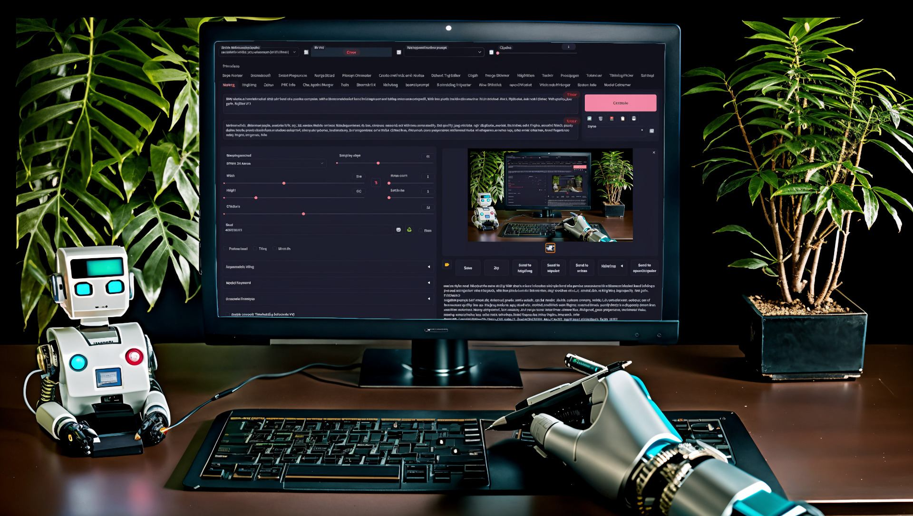

.. post:: 12.02.2023
   :tags: Stable Diffusion
   :category: Programming, Tutorial
   :title: Creating an extension for the stable diffusion webui
   :language: en
   :exclude:
   
   The documented creation of a small extension for the `stable diffusion webui <https://github.com/AUTOMATIC1111/stable-diffusion-webui>`_ which allows the user to create notes about stable diffusion models directly in the webui.

=====================================================
Creating an extension for the stable diffusion webui
=====================================================

The `stable diffusion webui <https://github.com/AUTOMATIC1111/stable-diffusion-webui>`_ is a gradio interface for `stable diffusion <https://stability.ai/blog/stable-diffusion-announcement>`_, 
supporting both versions 1 and 2. It sticks out through its extendability, in form of third-party scripts or extensions which can influence or completely change the functionality of the webui. 
This blogpost is about the creation about such an extension.

I created a small extensions for the stable diffusion webui which allows a user to save notes about different models. 
There is a huge selection of potential useful stable diffusion models, all with their own triggerwords, caveats or other things to keep in mind, which this extension should make easier. 
I decided to document the development since there is no real documentation on the extension creation beside the small entries in the webui wiki.

------
Setup
------

Extensions are loaded from the `extensions` subfolder in the webui folder. Every extension gets their own folder which must follow the given folder structure to be loaded correctly. 
Python scripts, which are loaded when the ui is loaded, must be in a `scripts` folder, all javascript files, which are added to the page when a user loads it, must be in the `javascript` folder. 
The structure of the finished extension can be found below.

.. code-block:: bash

   sd-webui-model-notes
   ├── javascript
   │   ├── hints.js
   │   └── update_note.js
   ├── notes.db # Created on first run
   └── scripts
      └── notes.py

   3 directories, 4 files

Creating the UI
================
---------------
Creating a tab
---------------

First i created a new tab where the user can edit existing or new notes, about user selected stable diffusion models. 
I used the script callback `on_ui_tabs() <https://github.com/AUTOMATIC1111/stable-diffusion-webui/blob/ea9bd9fc7409109adcd61b897abc2c8881161256/modules/script_callbacks.py#L236>`_, which automatically calls my function when the tabs are loaded.

.. code-block:: python

   from typing import Optional, Tuple
   import gradio as gr
   from modules.ui import create_refresh_button, save_style_symbol, checkpoint_alisases, list_models
   from modules.ui_components import FormRow
   from modules.sd_models import checkpoint_tiles, CheckpointInfo
   from modules import script_callbacks

   def on_ui_tabs() -> Tuple[gr.Blocks, str, str]:
      """
      Create the UI tab for model notes.
      """
      with gr.Blocks(analytics_enabled=False) as tab:
         with FormRow(elem_id="notes_mode_selection"):
               with FormRow(variant='panel'):
                  notes_model_select = gr.Dropdown(checkpoint_tiles(), elem_id="notes_model_dropdown", label="Select Stable Diffusion Checkpoint", interactive=True)
                  create_refresh_button(notes_model_select, list_models, lambda: {"choices": checkpoint_tiles()}, "refresh_notes_model_dropdown")
                  save_button = gr.Button(value="Save changes " + save_style_symbol, variant="primary", elem_id="save_model_note")
         note_box = gr.Textbox(label="Note", lines=25, elem_id="model_notes_textbox", placeholder="Make a note about the model selected above!", interactive=False)
         notes_model_select.change(fn=on_model_selection, inputs=[notes_model_select], outputs=[note_box])
            save_button.click(fn=on_save_note, inputs=[notes_model_select, note_box], outputs=[])
      return (tab, "Model Notes", "model_notes")

   script_callbacks.on_ui_tabs(on_ui_tabs)

The first component of the tab is a dropdown acting as the model selector, which lets the user pick models independently of the currently loaded one. 
I borrowed `checkpoint_tiles() <https://github.com/AUTOMATIC1111/stable-diffusion-webui/blob/ea9bd9fc7409109adcd61b897abc2c8881161256/modules/sd_models.py#L95>`_ from the webui, which returns a list of all stable diffusion models that are currently in the mdoels folder. 
The change function is a gradio component event, which gets called when the user selects a new entry in the dropdown. `interactive` must be set to true, or the dropdown will be disabled if updated.

.. code-block:: python

   notes_model_select = gr.Dropdown(checkpoint_tiles(), elem_id="notes_model_dropdown", label="Select Stable Diffusion Checkpoint", interactive=True)
   notes_model_select.change(fn=on_model_selection, inputs=[notes_model_select], outputs=[note_box])

The next component is a refresh button, which lets the user refresh the models listed in the dropdown. I borrowed `create_refresh_button() <https://github.com/AUTOMATIC1111/stable-diffusion-webui/blob/ea9bd9fc7409109adcd61b897abc2c8881161256/modules/ui.py#L384>`_ from the webui, which fully recreates the model list with all current models in the webui models folder. Additionally i changed the `variant` of the `FormRow` to `panel`, to create a visual connection between the dropdown and refresh button.

.. code-block:: python

   create_refresh_button(notes_model_select, list_models, lambda: {"choices": checkpoint_tiles()}, "refresh_notes_model_dropdown")

Next up i added the textbox, which is used to edit the note itself. I increased the `lines` to 25 to make it easier to edit big notes and `interactive` is set to false, to prevent the user from editing notes without a model selected. 

.. code-block:: python

   note_box = gr.Textbox(label="Note", lines=25, elem_id="model_notes_textbox", placeholder="Make a note about the model selected above!", interactive=False)

The last component is a save button, which lets the user save their note. For easier access and visual clarity, i decided to put the button beside the dropdown above the textbox. 

.. code-block:: python

   save_button = gr.Button(value="Save changes " + save_style_symbol, variant="primary", elem_id="save_model_note")
   save_button.click(fn=on_save_note, inputs=[notes_model_select, note_box], outputs=[])

The note texbox should automatically be updated with the correct note once a model is selected. I borrowed `checkpoint_alisases` dictionary from the webui to get the `CheckpointInfo <https://github.com/AUTOMATIC1111/stable-diffusion-webui/blob/ea9bd9fc7409109adcd61b897abc2c8881161256/modules/sd_models.py#L28>`_ of the selected model, create the short hash, which also calculates the full hash and pass the full hash along, to get the corresponding note.

.. code-block:: python

   def on_model_selection(model_name : str) -> str:
      """
      Get the note associated with the selected model.
      """
      checkpoint_info : CheckpointInfo = checkpoint_alisases.get(model_name)
      if checkpoint_info.sha256 is None: # Calculate hash if not already exists
         checkpoint_info.calculate_shorthash()
      result = get_note(str(checkpoint_info.sha256))
      return gr.update(value=result, interactive=True)

Lastly i replicated parts of the above function for the save button, leaving out the generation of the model hash, since it is already created when the model is selected.
I don't attempt to save a note when i cannot find a corresponding model since the save button can be pressed without selected model.

.. code-block:: python

   def on_save_note(model_name : str, note : str):
      """
      Save a note for the selected model.
      """
      checkpoint_info : Optional[CheckpointInfo] = checkpoint_alisases.get(model_name)
      if checkpoint_info is None:
         return
      set_note(checkpoint_info.sha256, note)

------------------------------------------
Adding components to generation Interface
------------------------------------------

Editing the existing interface is considerable more complex then just adding a new tab. This is prone to breaking in future webui updates as the generation ui constantly evolves. 
All additions are made within a class based on `Script <https://github.com/AUTOMATIC1111/stable-diffusion-webui/blob/ea9bd9fc7409109adcd61b897abc2c8881161256/modules/scripts.py#L19>`_ 
as explained in the `webui wiki <https://github.com/AUTOMATIC1111/stable-diffusion-webui/wiki/Developing-custom-scripts>`_. 
The `title() <https://github.com/AUTOMATIC1111/stable-diffusion-webui/blob/ea9bd9fc7409109adcd61b897abc2c8881161256/modules/scripts.py#L36>`_ and `show() <https://github.com/AUTOMATIC1111/stable-diffusion-webui/blob/ea9bd9fc7409109adcd61b897abc2c8881161256/modules/scripts.py#L49>`_ functions are required for the script to be loaded correctly, 
`title`` just returns the title of the script and `show` just returns when the script should be shown in the webui, which is set to always visible as the injected components are visible in all tabs. This also prevents the script from showing up in the script selection menu.
I inject the components by listening to the `after_component() <https://github.com/AUTOMATIC1111/stable-diffusion-webui/blob/ea9bd9fc7409109adcd61b897abc2c8881161256/modules/scripts.py#L132>`_ 
event, which get called every time a component is created and i check the `elem_id` to see what component was created. This event gets only called for components but not containers like `Rows`, 
limiting the flexibility of this system.

.. code-block:: python

   from modules import scripts
   from modules.ui_components import ToolButton
   from modules.shared import opts, OptionInfo

   notes_symbol = '\U0001F4DD' # 📝

   class NoteButtons(scripts.Script):
   """
   This script creates a button for users to add notes about a selected model
   """

   note_container = gr.Column(min_width=1920, elem_id="notes_container", visible=False)
   state_visible = gr.State(value=False)

   def title(self) -> str:
      """
      Return the title of the script.

      :return: The title of the script.
      """
      return "Model Notes"

   def show(self, is_img2img: bool) -> object:
      """
      Return the show condition of the script.
      
      :param is_img2img: If the current tab is img2img .
      :return: Object that represents that the script should be shown at all times.
      """
      return scripts.AlwaysVisible

   def on_save_note(self, note: str) -> None:
      """
      Save a note about the selected model
      """
      set_note(opts.sd_checkpoint_hash, note)

   def on_get_note(self) -> gr.update:
      """
      Get the note about the selected model and update it to the UI
      """
      return gr.update(value=get_note(opts.sd_checkpoint_hash), label=f"Note on {opts.sd_model_checkpoint}")

   def after_component(self, component, **kwargs):
      """
      Create the UI for adding a note and updating it.
      """
      if kwargs.get("elem_id") and "_style_create" in kwargs.get("elem_id"):

         notes_tool_btn = ToolButton(value=notes_symbol, elem_id="model_notes_tool")

         def toggle_visibility(is_visible: bool) -> Tuple[bool, gr.update]:
               """
               Toggles the visibility of an element.
               """
               is_visible = not is_visible
               return is_visible, gr.update(visible=is_visible)

         state_visible = gr.State(value=False)
         notes_tool_btn.click(fn=toggle_visibility, inputs=[state_visible], outputs=[state_visible, self.note_container])

      if kwargs.get("elem_id") and "_neg_prompt" in kwargs.get("elem_id"):
         with gr.Column(min_width=1920, elem_id="notes_container", visible=False) as self.note_container:
               with FormRow(elem_id="notes_mode_selection"):
                  tex = gr.Textbox(label="Note", lines=5, elem_id="model_notes_textbox", placeholder="Make a note about the model selected above!", interactive=True)
                  save_button = gr.Button(value="Save changes " + save_style_symbol, variant="primary", elem_id="save_model_note")
                  save_button.click(fn=self.on_save_note, inputs=[tex], outputs=[])
               update_button = ToolButton(value=notes_symbol, elem_id="model_note_update", visible=False)
               update_button.click(fn=self.on_get_note, inputs=[], outputs=[tex])

The first component is the note textbox, similar to the already existing textbox in my notes tab. `interactive` is set to true since there is always a model loaded, 
preventing invalid note creations. Some components have different names depending on their tab like `txt2img_neg_prompt` or `img2img_neg_prompt` which are the negative prompt textboxes for the txt2img and img2img tabs. 
Since i wanted to inject the components on both tabs, i just checked if `_neg_prompt` is in the current id and then inject the textbox. 
I increased the minimal width to force a new line and put the textbox below the negative prompt instead of beside it. 
There appears to be no better way to format the ui, making this workaround the best solution. 
I also display the current model name in the title of the textbox to prevent accidental changes to an old note while a new model is still loading. 

.. code-block:: python

   tex = gr.Textbox(label="Note", lines=5, elem_id="model_notes_textbox", placeholder="Make a note about the model selected above!", interactive=True)

Once again i added a save button to let the user save their note. I changed the `variant` to `primary` to let it stick more out.

.. code-block:: python

   save_button = gr.Button(value="Save changes " + save_style_symbol, variant="primary", elem_id="save_model_note")
   save_button.click(fn=self.on_save_note, inputs=[tex], outputs=[])

The current note textbox does not get automatically updated when a new model is loaded. 
To change that, i wanted to use the `on_model_loaded() <https://github.com/AUTOMATIC1111/stable-diffusion-webui/blob/ea9bd9fc7409109adcd61b897abc2c8881161256/modules/script_callbacks.py#L230>`_ 
script callback, which is called when a new model is loaded, but gradio needs an component event that cannot be manually created to update a component. 
As a workaround i added a hidden button which updates the note textbox when pressed.

.. code-block:: python

   update_button = ToolButton(value=notes_symbol, elem_id="model_note_update", visible=False)
   update_button.click(fn=self.on_get_note, inputs=[], outputs=[tex])

Since the button is not visible to user, i had to use javascript to click the button and create the gradio component event. 
Some variables are exposed to the javascript runtime, which i used to add a timer, which compares the current `opts.sd_checkpoint_hash <https://github.com/AUTOMATIC1111/stable-diffusion-webui/blob/ea9bd9fc7409109adcd61b897abc2c8881161256/modules/shared.py#L493>`_, 
which represents the sha256 hash of the current loaded model, to the last known model hash. If the hash differs then this means a new model was loaded and the update button is clicked.

.. code-block:: javascript

   // Store the previous checkpoint hash value
   let previousCheckpointHash = opts.sd_checkpoint_hash;

   function setup_note_interval()
   {
      setInterval(function() 
      {
         // When a new model was selected, update the note
         if (opts.sd_checkpoint_hash !== previousCheckpointHash) 
         {
            previousCheckpointHash = opts.sd_checkpoint_hash;
            triggerOnCheckpointChange();
         }
      }, 500); // Check every 500 ms
   }

   function triggerOnCheckpointChange() 
      {
      // Create an update event and update notes in every tab
      gradioApp().querySelectorAll('#model_note_update').forEach(function(refresh_button) 
      {
         refresh_button.click();
      });
   }

   // Wait until all DOM Content is loaded before checking for new models
   document.addEventListener('DOMContentLoaded', setup_note_interval);

Lastly i added a small button to toggle the note textbox. I borrowed `ToolButton() <https://github.com/AUTOMATIC1111/stable-diffusion-webui/blob/ea9bd9fc7409109adcd61b897abc2c8881161256/modules/ui_components.py#L4>`_ 
to replicate the look of the tool buttons and injected it to be last in the list of tools.

.. code-block:: python

   if kwargs.get("elem_id") and "_style_create" in kwargs.get("elem_id"):
      notes_tool_btn = ToolButton(value=notes_symbol, elem_id="model_notes_tool")
      state_visible = gr.State(value=False)
      notes_tool_btn.click(fn=toggle_visibility, inputs=[state_visible], outputs=[state_visible, self.note_container])
      def toggle_visibility(is_visible: bool) -> Tuple[bool, gr.update]:
            """
            Toggles the visibility of an element.
            """
            is_visible = not is_visible
            return is_visible, gr.update(visible=is_visible)

Adding functionality
=====================
--------------------------
Creating a Settings Entry
--------------------------

Managing settings is not handled by the extension but by the webui itself, which simplifies the process. I just created a script callback to `on_ui_settings() <https://github.com/AUTOMATIC1111/stable-diffusion-webui/blob/ea9bd9fc7409109adcd61b897abc2c8881161256/modules/script_callbacks.py#L256>`_ 
and added a title. I also needed to declare an internal name, the description, which should tell the user what the option does, the type, which is just a checkbox in this case, 
the default value and which values are allowed to be entered. This is optional for some components, like the checkbox since there can only be two values.
The internal name should be unique and prefixed by the extension name to prevent interfering with the webui or other extensions. 
The current value of the setting can always be accessed by its internal name in `opts <https://github.com/AUTOMATIC1111/stable-diffusion-webui/blob/ea9bd9fc7409109adcd61b897abc2c8881161256/modules/shared.py#L635>`_.

.. code-block:: python

   def on_ui_settings() -> None:
         """
         Add options to the UI settings page.
         """
         opts.add_option("model_note_autosave", OptionInfo(default=False, label="Enable autosaving edits in note fields", component=gr.Checkbox, section=("model-notes", "Model-Notes")))

   script_callbacks.on_ui_settings(on_ui_settings)

The setting above toggles if the note should be saved every time the note textbox is edited or if a save button should be used. This functionality can be added with a few changes to the existing ui code.

.. code-block:: python

   def on_ui_tabs() -> Tuple[gr.Blocks, str, str]:
      """
      Create the UI tab for model notes.
      """
      with gr.Blocks(analytics_enabled=False) as tab:
         with FormRow(elem_id="notes_mode_selection"):
               with FormRow(variant='panel'):
                  notes_model_select = gr.Dropdown(checkpoint_tiles(), elem_id="notes_model_dropdown", label="Select Stable Diffusion Checkpoint", interactive=True)
                  create_refresh_button(notes_model_select, list_models, lambda: {"choices": checkpoint_tiles()}, "refresh_notes_model_dropdown")
               if not opts.model_note_autosave:
                  save_button = gr.Button(value="Save changes " + save_style_symbol, variant="primary", elem_id="save_model_note")
         note_box = gr.Textbox(label="Note", lines=25, elem_id="model_notes_textbox", placeholder="Make a note about the model selected above!", interactive=False)
         if opts.model_note_autosave:
               note_box.change(fn=on_save_note, inputs=[notes_model_select, note_box], outputs=[])
         notes_model_select.change(fn=on_model_selection, inputs=[notes_model_select], outputs=[note_box])
         if not opts.model_note_autosave:
               save_button.click(fn=on_save_note, inputs=[notes_model_select, note_box], outputs=[])
      return (tab, "Model Notes", "model_notes"),

   def after_component(self, component, **kwargs):
      """
      Create the UI for adding a note and updating it.
      """
      if kwargs.get("elem_id") and "_neg_prompt" in kwargs.get("elem_id"):
            with gr.Column(min_width=1920, elem_id="notes_container", visible=False) as self.note_container:
               with FormRow(elem_id="notes_mode_selection"):
                  tex = gr.Textbox(label="Note", lines=5, elem_id="model_notes_textbox", placeholder="Make a note about the model selected above!", interactive=True)
               if opts.model_note_autosave:
                  tex.change(fn=self.on_save_note, inputs=[tex], outputs=[])
               else:
                  save_button = gr.Button(value="Save changes " + save_style_symbol, variant="primary", elem_id="save_model_note")
                  save_button.click(fn=self.on_save_note, inputs=[tex], outputs=[])
               update_button = ToolButton(value=notes_symbol, elem_id="model_note_update", visible=False)
               update_button.click(fn=self.on_get_note, inputs=[], outputs=[tex])

-------------------
Loading and saving 
-------------------

So far i only created the user interface but no notes can be saved or read. I decided to use sqlite3 to save and retrieve notes, due to its ease of use.
First i needed to create a connection to the SQLite database when the script is loaded, by creating the connection with a script callback to `on_app_started() <https://github.com/AUTOMATIC1111/stable-diffusion-webui/blob/ea9bd9fc7409109adcd61b897abc2c8881161256/modules/script_callbacks.py#L224>`_. 
For the path of the database file, i can't rely on any static path since the user might rename their webui or notes-extension folder, 
which is the reason i decided to derive the path based on the location of the main script file. Gradio is multithreaded and might access the database connection from a different thread, 
resulting in a `ProgrammingError <https://docs.python.org/3/library/sqlite3.html#sqlite3.ProgrammingError>`_. To prevent this error, i changed `check_same_thread` to `False` when the connection is created. 
I also added a function to simplify the execution of any sql queries. Lastly i closed the connection when the script is unloaded, as extensions and scripts are expected to clean up after themselves.

.. note::

   Using one SQLite connection from different threads is potentially unsafe if the underlying SQLite library is compiled with default settings. 
   See `threadsafety <https://docs.python.org/3/library/sqlite3.html#sqlite3.threadsafety>`_ for more information. 

.. code-block:: python

   import sqlite3
   from sqlite3 import Error
   from pathlib import Path

   def create_connection(db_file: str) -> None:
      """ 
      Creates a database connection to a SQLite database 
      """
      global conn
      try:
         conn = sqlite3.connect(db_file, check_same_thread=False)
      except Error as e:
         print(e)

   def on_app_started(gradio, fastapi) -> None:
      """
      Called when the application starts.
      """
      create_connection(Path(Path(__file__).parent.parent.resolve(), "notes.db"))

   def execute_sql(sql: str, *data) -> list:
      """
      Executes an SQL statement and returns the result as a list of rows.
      """
      try:
         cur = conn.cursor()
         cur.execute(sql, data)
         conn.commit()
         return cur.fetchall()
      except Error as e:
         print(e)

   def on_script_unloaded() -> None:
      """
      Close the database connection when the script is unloaded
      """
      if conn:
         conn.close()

   script_callbacks.on_app_started(on_app_started)
   script_callbacks.on_script_unloaded(on_script_unloaded)

After the connection is made, i create all tables if they do not exist yet. I map every note to the full hash of a model to prevent any collisions.

.. code-block:: python

   def setup_db() -> None:
      """
      Sets up the SQLite database by creating tables if they do not already exist.
      """
      notes_table = """
      CREATE TABLE IF NOT EXISTS notes (
         model_hash text PRIMARY KEY,
         note text NOT NULL
      );
      """
      execute_sql(notes_table)

Lastly i added some functions that simplify reading and saving notes to the database.

.. code-block:: python

   def set_note(model_hash: str, note: str) -> None:
      """
      Save a note in the database for the given model.
      """
      sql = """
      REPLACE INTO notes(model_hash, note) VALUES(?, ?);
      """
      execute_sql(sql, model_hash, note)

   def get_note(model_hash: str) -> str:
      """
      Retrieve the saved note for the given model.
      """
      sql = """
      SELECT note FROM notes WHERE model_hash = ?
      """
      rows = execute_sql(sql, model_hash)
      note : str = rows[0][0] if rows != [] else ""
      return note

Finishing up
=============
----------
Polishing
----------

Providing additional information about the user is done selectively in the webui with titles which appear on hover. 
I originally wanted to extend this system but after a closer inspection it appeared too flawed to be useful. 
The hover hint system is a system written in javascript which uses the value or class of an object to determine its hover text. 
This potentially leads to collisions and is overall tedious to maintain since the hover text needs to be updated every time the text or class of the component changes. 
I ended up adapting the existing system to use the `elem_id` of components to inject the correct hover text which addressed all of these issues.

.. code-block:: javascript

   // Hints mapped to element ids
   model_notes_titles = 
   {
      "notes_model_dropdown" : "Select a Stable-Diffusion Model to write a Note for",
      ...
   }

   onUiUpdate(function()
   {
      // Iterate over every hint
      Object.entries(model_notes_titles).forEach(([key, value]) => 
      {
         // In case we have several objects with the same id, we iterate over all found elements
         gradioApp().querySelectorAll(`#${key}`).forEach(function(element)
         {
               tooltip = model_notes_titles[element.id];
               if(tooltip)
               {
                  element.title = tooltip;
               }
         })
      });
   })

-----------
Conclusion
-----------

This extension should make it hopefully easier to keep track of all the different caveats from all the different models. 
Most of this blogpost was written using the webui code as reference since most of the process is undocumented. 
I strongly recommend also reading the code of other extensions as they contain helpful hints about interacting with the webui. 
Most extensions can be found by `searching for the webui on Github <https://github.com/search?q=stable-diffusion-webui>`_. 

------
Links
------

- `AUTOMATIC1111 stable-diffusion-webui <https://github.com/AUTOMATIC1111/stable-diffusion-webui>`_ (Commit `ea9bd9fc7409109adcd61b897abc2c8881161256 <https://github.com/AUTOMATIC1111/stable-diffusion-webui/tree/ea9bd9fc7409109adcd61b897abc2c8881161256>`_ at the time of writing)
- `Model notes extension <https://github.com/lpawlick/sd-webui-model-notes>`_